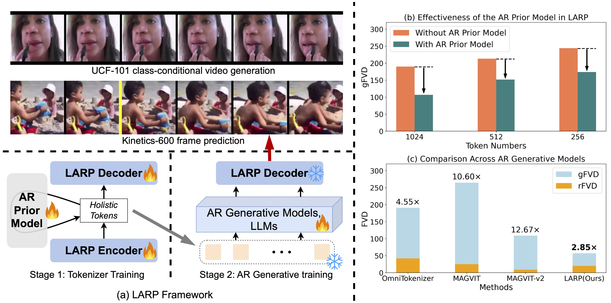
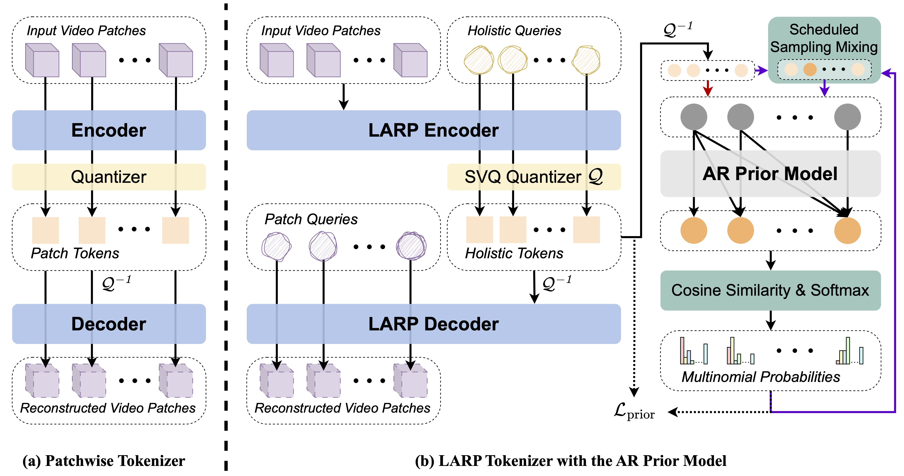

# LARP: Tokenizing Videos 🎬 with a Learned Autoregressive Generative Prior 🚀

<div align="center">

[](https://arxiv.org/abs/xxx)&nbsp;
[](https://hywang66.github.io/larp)&nbsp;

</div>

<p align="center">

<p>

## Overview

We present LARP, a novel video tokenizer inherently aligned with autoregressive (AR) generative models. LARP employs a holistic tokenization approach, leveraging learned queries to capture global and semantic representations. Moreover, it integrates a lightweight AR transformer during training, structuring the latent space to optimize both video reconstruction and autoregressive generation. LARP outperforms state-of-the-art methods on video generation tasks, achieving competitive performance. 

<p align="center">

<p>


## Get Started

1. Install pytorch 2.4.0 and torchvision 0.19.0
   ```
   pip install torch==2.4.0 torchvision==0.19.0 torchaudio==2.4.0 --index-url https://download.pytorch.org/whl/cu124
   ```

2. Install other dependencies
   ```
   pip install -r requirements.txt
   ```
   
3. Set up the datasets using `set_datasets.sh`
    <details>
    <summary> This script sets up datast for UCF-101 and Kinetics-600 datasets. </summary>

    You need to download the datasets you want to use and set the paths in the script. This script will create the necessary symbolic links so that the code can find the data.

    After setting up the datasets, verify that all paths in the CSV files located in data/metadata are accessible.


## Pretrained Models

We provide pretrained models for LARP tokenizer, LARP AR model, and LARP AR frame prediction model.
| Model                 | #params | FVD         | 🤗 HuggingFace                                                                  |
| --------------------- | ------- | ----------- | ------------------------------------------------------------------------------ |
| LARP-L-Long-tokenizer | 173M    | 20 (recon.) | <center>[link](https://huggingface.co/hywang66/LARP-L-long-tokenizer)</center> |
| LARP-L-Long-AR        | 632M    | 57 (gen.)   | <center>[link](https://huggingface.co/hywang66/LARP-L-long-AR)</center>        |
| LARP-L-Long-AR-FP     | 632M    | 5.1 (FP)    | <center>[link](https://huggingface.co/hywang66/LARP-L-long-AR-FP)</center>     |

Please refer to the **sampling and evaluation** section for details on how to use these models.
   

## Training

We provide scripts for training LARP tokenizer, LARP AR model, and LARP AR frame prediction model using a single GPU.
<!-- Note that all scripts are configured to run on an 8-GPU machine. You may need to adjust the batch size and number of dataloader workers if you have fewer GPUs. -->

### Training LARP Tokenizer
```bash
bash scripts/train_larp_tokenizer.sh
```

### Training LARP AR model on UCF-101 dataset
```bash
bash scripts/train_larp_ar.sh
```

### Training LARP AR frame prediction model on Kinetics-600 dataset
```bash
bash scripts/train_larp_ar_fp.sh
```

### Reproducing the Pretrained Models
To reproduce the pretrained models released on HuggingFace, refer to the following training scripts:
```bash
scripts/train_larp_tokenizer_reproduce.sh
scripts/train_larp_ar_reproduce.sh
scripts/train_larp_ar_fp_reproduce.sh
```


## Sampling and Evaluation

The `sample.py` script can be used to sample videos from the LARP AR model and LARP AR frame prediction model. It also computes the Frechet Video Distance (FVD) score with the real videos. 
The `eval/eval_larp_tokenizer.py` script can be used to evaluate reconstruction performance of the LARP tokenizer.
Unless specified, all commands in this section are supposed to be run on an single GPU machine.


### UCF101 Class-conditional Generation

The following command samples 10,000 videos from the LARP AR model trained on UCF-101 dataset and compute the FVD score with the real videos.
The videos are generated class-conditionally, i.e., each video is generated from a single class. 
Note that the UCF-101 dataset is required to run this run this script. 

This command can reproduce the UCF-101 generation FVD results reported in the Table 1 of the paper. 

```bash
python3 sample.py \
    --ar_model hywang66/LARP-L-long-AR \
    --tokenizer hywang66/LARP-L-long-tokenizer \
    --output_dir samples/ucf_reproduce \
    --num_samples 10000 \
    --sample_batch_size 64 \
    --cfg_scale 1.25 \
    --dtype bfloat16 \
    --dataset_csv ucf101_train.csv \
    --dataset_split_seed 42
```

The FVD score will be displayed at the end of the script and also appended to the fvd_report.csv file in the project directory.


### Kinetics-600 Frame Prediction

The following command predicts the next 11 frames conditioned on the previous 5 frames using the LARP AR frame prediction model trained on Kinetics-600 dataset. 50,000 samples are generated and used to compute the FVD score with the real videos. 
Note that the Kinetics-600 dataset is required to run this run this script. 

This command can reproduce the Kinetics-600 frame prediction FVD results reported in the Table 1 of the paper. 

```bash
python3 sample.py \
    --fp --num_cond_frames 5 \
    --ar_model hywang66/LARP-L-long-AR-FP \
    --tokenizer hywang66/LARP-L-long-tokenizer \
    --output_dir samples/k600_FP_reproduce \
    --num_samples 50000 \
    --sample_batch_size 64 \
    --dtype bfloat16 \
    --dataset_csv k600_val.csv \
    --dataset_split_seed 42
```

The FVD score will be displayed at the end of the script and also appended to the fvd_report.csv file in the project directory.


### Parallel Sampling and Evaluation

When multiple GPUs are available, `sample.py` can be run in parallel to accelerate the sampling process. Set the `--num_samples` argument to specify the **per-GPU** number of samples, and use the `--num_samples_total` argument to define the total number of samples. Importantly, set the `--starting_index` argument to specify the starting index for this process, ensuring that it samples videos from `--starting_index` to `--starting_index + --num_samples` (exclusive). 

Example commands:
```bash
python3 sample.py \
    --ar_model hywang66/LARP-L-long-AR \
    --tokenizer hywang66/LARP-L-long-tokenizer \
    --output_dir samples/ucf_reproduce \
    --num_samples 128 \
    --num_samples_total 10000 \
    --starting_index 0 \
    --sample_batch_size 64 \
    --cfg_scale 1.25 \
    --dtype bfloat16 \
    --dataset_csv ucf101_train.csv \
    --dataset_split_seed 42

python3 sample.py \
    --ar_model hywang66/LARP-L-long-AR \
    --tokenizer hywang66/LARP-L-long-tokenizer \
    --output_dir samples/ucf_reproduce \
    --num_samples 128 \
    --num_samples_total 10000 \
    --starting_index 32 \
    --sample_batch_size 64 \
    --cfg_scale 1.25 \
    --dtype bfloat16 \
    --dataset_csv ucf101_train.csv \
    --dataset_split_seed 42

......

python3 sample.py \
    --ar_model hywang66/LARP-L-long-AR \
    --tokenizer hywang66/LARP-L-long-tokenizer \
    --output_dir samples/ucf_reproduce \
    --num_samples 16 \
    --num_samples_total 10000 \
    --starting_index 9984 \
    --sample_batch_size 64 \
    --cfg_scale 1.25 \
    --dtype bfloat16 \
    --dataset_csv ucf101_train.csv \
    --dataset_split_seed 42

```

Ensure there is no overlap in sample indices across processes, and assign each process to a different GPU. Once all processes have completed (in any order), the FVD score will be automatically calculated and appended to the `fvd_report.csv` file in the project directory.


### LARP Tokenizer Reconstruction Evaluation

The following command evaluates the LARP tokenizer on the UCF-101 dataset. The script computes the reconstruction FVD (rFVD) and other related metrics. 
Note that the UCF-101 dataset is required to run this run this script. 

This command can reproduce the LARP tokenizer reconstruction FVD results reported in the Table 1 of the paper.

```bash
python3 eval/eval_larp_tokenizer.py \
    --tokenizer hywang66/LARP-L-long-tokenizer \
    --dataset_csv ucf101_train.csv \
    --use_amp --det
```


## Citation

If you find this code useful in your research, please consider citing:
```
TBD
```